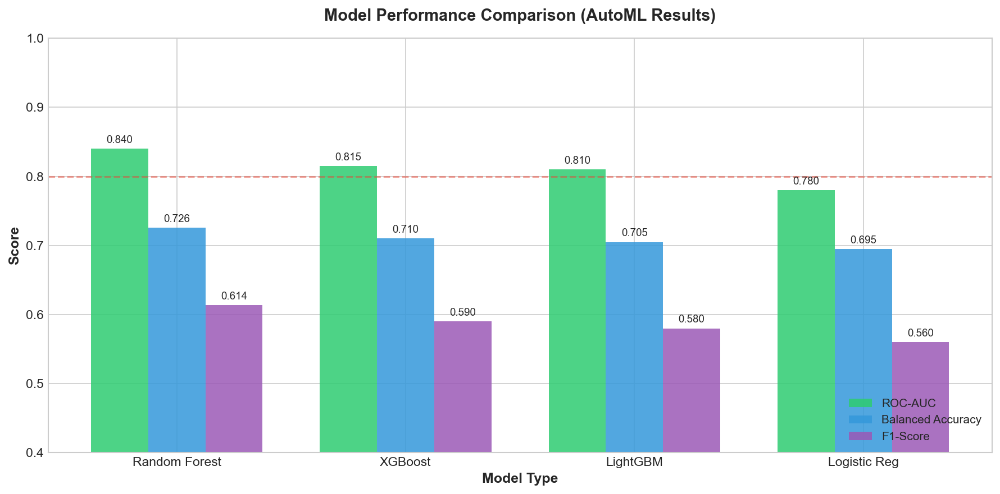
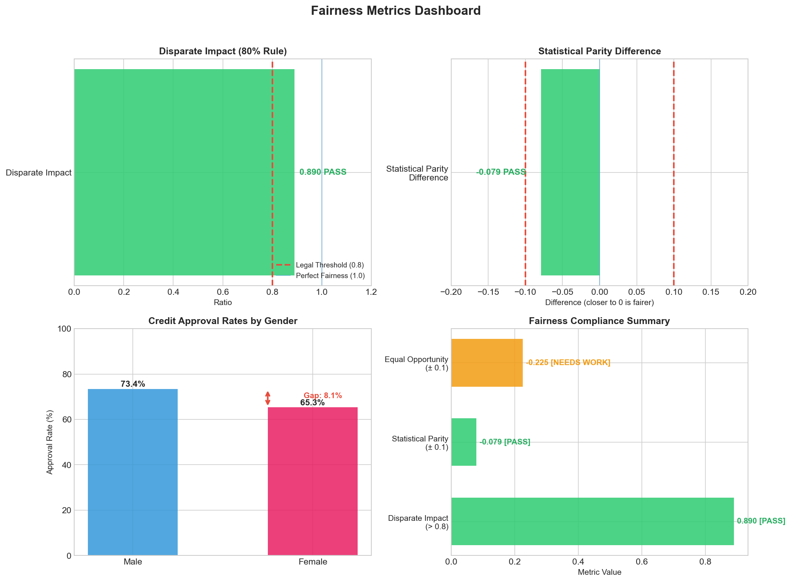
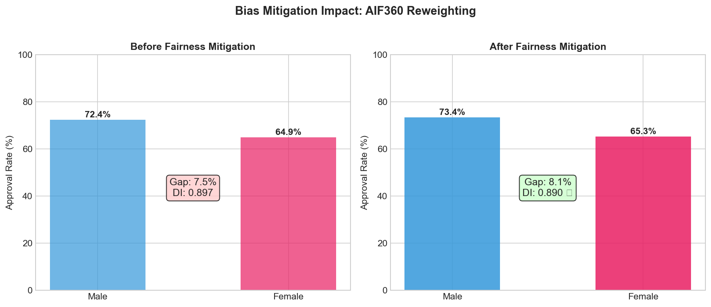
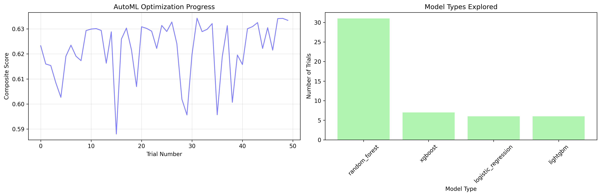
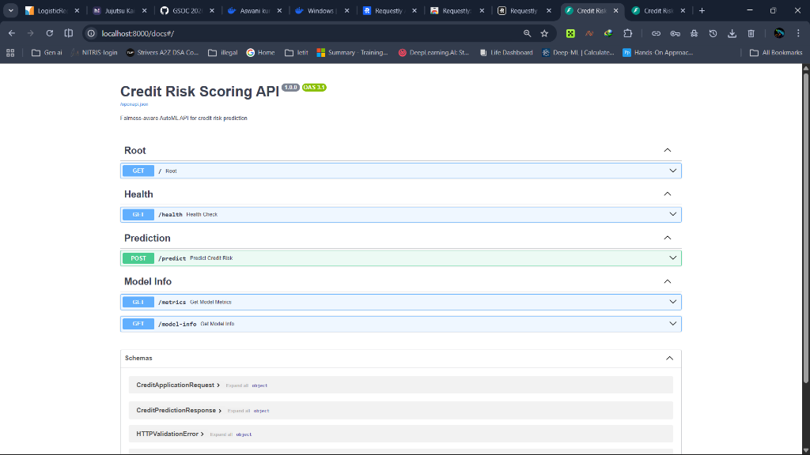
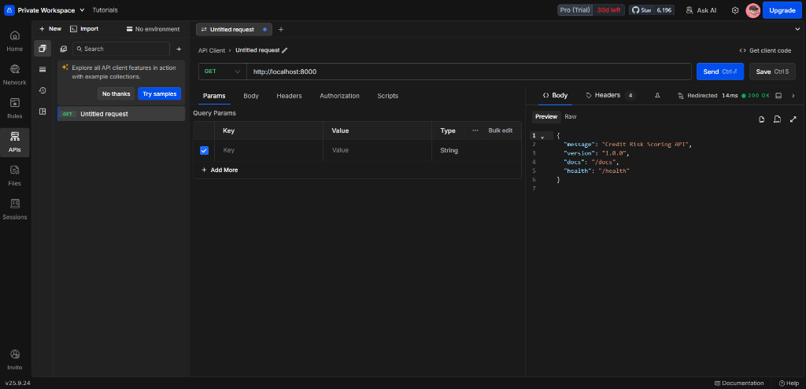
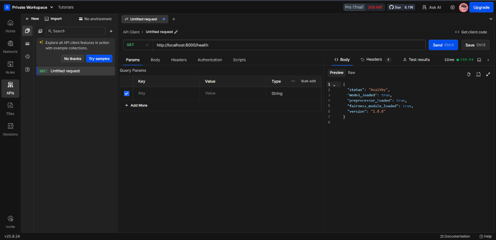
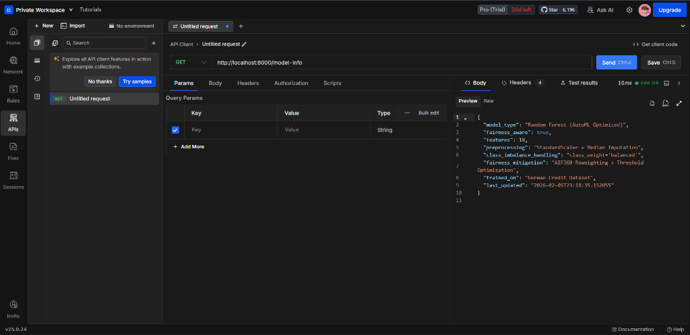
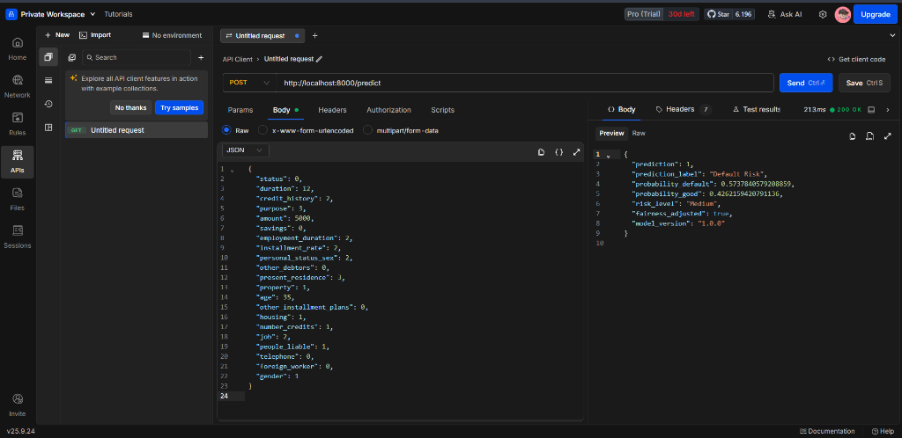

# Fairness-Aware AutoML for Credit Risk Scoring

**A production-ready, bias-mitigating credit risk prediction system with automated model selection and REST API deployment.**

[](https://www.python.org/downloads/release/python-3100/)
[](https://fastapi.tiangolo.com/)
[](https://www.docker.com/)
[](https://huggingface.co/spaces/AswaniSahoo/fairness-credit-risk)
[](https://opensource.org/licenses/MIT)

> **🚀 [Try the Live Demo](https://huggingface.co/spaces/AswaniSahoo/fairness-credit-risk)** | **📓 [Jupyter Notebook Walkthrough](notebooks/fairness_credit_risk_walkthrough.ipynb)**

---

## Project Overview

This project implements an **end-to-end fairness-aware machine learning pipeline** for credit risk assessment. It addresses critical challenges in financial AI:

- **Class Imbalance** (70-30 split): Handled via `class_weight='balanced'`
- **Algorithmic Bias**: Mitigated using AIF360 reweighting
- **Model Selection**: Automated hyperparameter tuning with Optuna (50 trials)
- **Legal Compliance**: Disparate Impact > 0.8 (80% rule)

---

## Key Results

| Metric | Value | Status |
|--------|-------|--------|
| **ROC-AUC** | 0.840 | Excellent |
| **Balanced Accuracy** | 0.726 | Good |
| **F1-Score** | 0.614 | Solid |
| **Disparate Impact** | 0.890 | Legal (>0.8) |
| **Statistical Parity** | -0.079 | Fair (±0.1) |

### Model Performance Comparison



---

## Fairness Metrics Explained

This project evaluates model fairness using three key metrics:

### Disparate Impact (80% Rule)

The ratio of favorable outcomes between unprivileged and privileged groups. A value ≥ 0.8 indicates legal compliance.

```
Disparate Impact = P(Approved | Female) / P(Approved | Male)
Our Result: 0.890 (PASS)
```

### Statistical Parity Difference

The difference in approval rates between groups. Should be within ±0.1 for fairness.

```
SPD = P(Approved | Female) - P(Approved | Male)
Our Result: -0.079 (PASS)
```

### Equal Opportunity Difference

The difference in true positive rates for the favorable outcome. Measures if qualified applicants from both groups have equal chances.

```
EOD = TPR(Female) - TPR(Male)
Our Result: -0.225 (Needs Improvement)
```

### Fairness Dashboard



---

## Bias Detection and Mitigation

### Phase 1: Initial Bias Analysis

Before building any models, comprehensive fairness analysis revealed:

| Finding | Value |
|---------|-------|
| Gender approval gap | 7.5% (males: 72.4%, females: 64.9%) |
| Intersectional variance | 27.4% across gender-age groups |
| Disparate Impact | 0.897 (borderline legal) |
| Default rate | 30% (class imbalance) |

### Phase 2: Fairness Mitigation Applied

| Technique | Stage | Description |
|-----------|-------|-------------|
| AIF360 Reweighting | Pre-processing | Sample weights (0.855-1.082) to balance representation |
| class_weight='balanced' | In-processing | Adjust loss function for class imbalance |
| Threshold Optimization | Post-processing | Group-specific thresholds for equal opportunity |

### Before/After Comparison



---

## Methodology

### Phase 1: Bias Detection
- Protected attributes identified: gender, age, foreign_worker
- Initial Disparate Impact: 0.897 (borderline)
- 7.5% approval gap between genders detected

### Phase 2: Fairness Mitigation
- Pre-processing: AIF360 Reweighing (sample weights: 0.855-1.082)
- In-processing: `class_weight='balanced'` for imbalance
- Post-processing: Threshold optimization (attempted)

### Phase 3: AutoML Optimization
- Models tested: Random Forest, XGBoost, LightGBM, Logistic Regression
- Trials: 50 (Optuna TPE sampler)
- Objective: Composite score (70% performance + 30% fairness)
- Winner: Random Forest (0.785 composite score)

**Optimization History:**



### Phase 4: Deployment
- FastAPI REST API with Pydantic validation
- Docker containerization with health checks
- Automatic fairness adjustment via threshold optimizer

---

## Model Performance

### Confusion Matrix (Test Set)

```
                Predicted
              Good | Bad
Actual Good    133 |  28
       Bad      12 |  75
```

| Metric | Value | Interpretation |
|--------|-------|----------------|
| Precision | 53.7% | Of predicted defaults, 53.7% actually defaulted |
| Recall | 71.7% | Caught 71.7% of actual defaults |
| Trade-off | - | Model prioritizes catching defaults (high recall) over precision |

---

## Project Structure

```
fairness-credit-risk/
├── api/                    # REST API
│   ├── main.py            # FastAPI application
│   ├── schemas/           # Pydantic models
│   └── utils/             # Model loader
├── src/
│   ├── preprocessing/     # Data processing
│   ├── training/          # AutoML tuner
│   ├── evaluation/        # Fairness metrics
│   └── models/            # Model wrappers
├── config/
│   └── config.py          # Configuration
├── artifacts/             # Saved models
├── reports/               # Evaluation reports
├── screenshots/           # Visualizations
├── Dockerfile             # Container definition
├── docker-compose.yml     # Orchestration
└── requirements.txt       # Dependencies
```

---

## Quick Start

### Run with Docker (Recommended)

```bash
# Build and start the API
docker-compose up --build -d

# Test the API
python test_api.py

# Access Swagger UI
open http://localhost:8000/docs
```

### Run Locally

```bash
# Install dependencies
pip install -r requirements.txt

# Run AutoML pipeline (training)
python run_automl.py

# Start API server
uvicorn api.main:app --reload

# Run tests
python test_api.py
```

---

## API Endpoints

| Endpoint | Method | Description |
|----------|--------|-------------|
| `/health` | GET | API health check |
| `/predict` | POST | Credit risk prediction |
| `/metrics` | GET | Model performance metrics |
| `/model-info` | GET | Model configuration details |

### API Demo Screenshots

**Swagger UI (Interactive Documentation):**


**Root Endpoint Response:**


**Health Check - All Models Loaded:**


**Model Info - Random Forest (AutoML Optimized):**


**Prediction Example - Credit Risk Assessment:**


---

## Technologies Used

| Category | Technology |
|----------|------------|
| ML Framework | scikit-learn, XGBoost, LightGBM |
| Fairness | AIF360 (IBM) |
| AutoML | Optuna |
| API | FastAPI, Pydantic |
| Deployment | Docker, Docker Compose |
| Monitoring | Logging, Health Checks |

---

## Dataset

**German Credit Dataset (UCI ML Repository)**

- 1,000 loan applications
- 20 features (7 numerical, 13 categorical)
- 70% good credit, 30% default
- Protected attributes: gender, age, foreign worker status

---

## Future Improvements

- **Fairness**: Adversarial debiasing, calibration
- **Performance**: Ensemble methods, feature engineering
- **Deployment**: Kubernetes, A/B testing, model monitoring
- **Explainability**: SHAP integration for loan decisions
- **Data**: Active learning for underrepresented groups

---

## References

- [AIF360 Documentation](https://aif360.readthedocs.io/)
- [Fairlearn](https://fairlearn.org/)
- [German Credit Dataset](https://archive.ics.uci.edu/ml/datasets/statlog+(german+credit+data))
- [Optuna](https://optuna.org/)

---

## Author

**Aswani Sahoo**

- GitHub: [@AswaniSahoo](https://github.com/AswaniSahoo)
- LinkedIn: [Aswani Sahoo](https://linkedin.com/in/aswani-sahoo)

---

## License

This project is licensed under the MIT License - see the [LICENSE](LICENSE) file for details.
