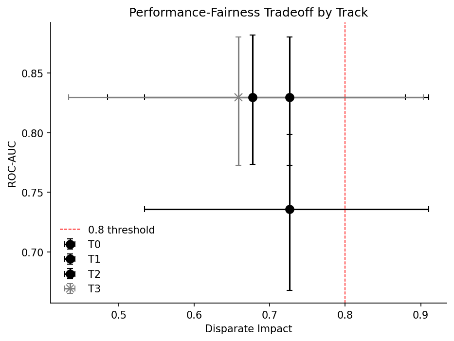
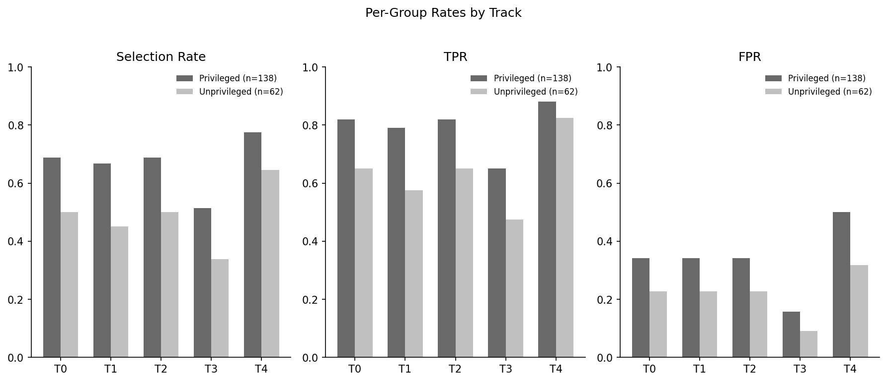
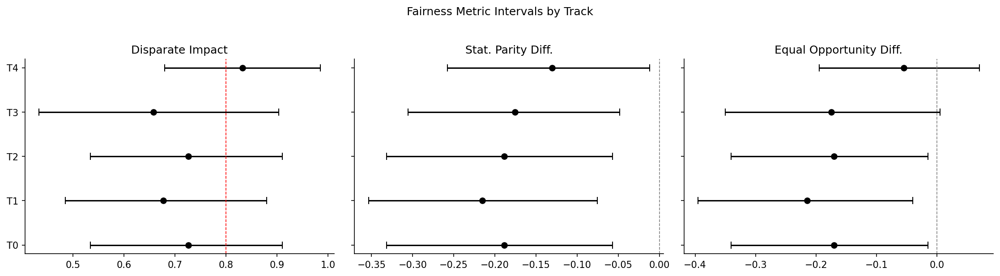
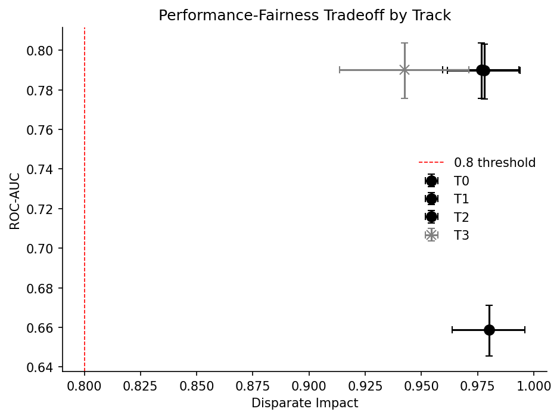
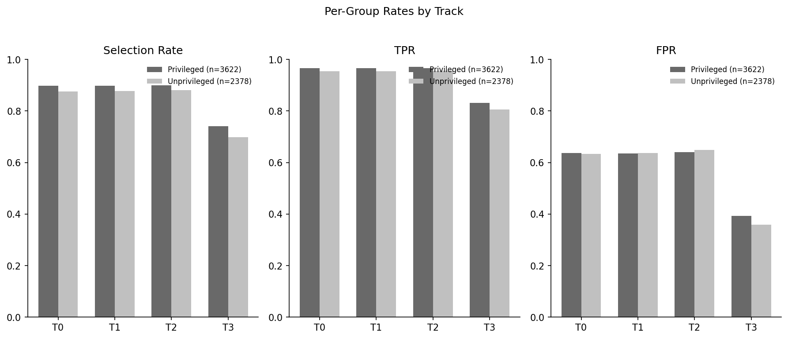
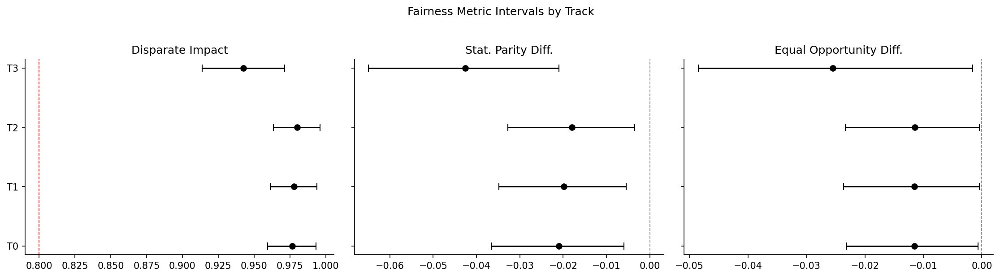

# Fairness-Aware Credit Risk Scoring

Four fairness interventions, measured against a tuned baseline under identical conditions, on
two datasets. The interesting result is that none of them helped much, and the reasons why are
different for each.

[](https://www.python.org/downloads/)
[](tests/)
[](LICENSE)

Every number in this README is generated from [`reports/track_comparison.json`](reports/track_comparison.json)
by [`scripts/generate_report_assets.py`](scripts/generate_report_assets.py). None is typed by
hand. An earlier version of this project published a comparison chart whose values appear in no
artifact at all, which is why that rule now exists and is enforced by a test.

---

## What this measures

A credit risk model can be unfair in ways that a single accuracy number hides. The standard
remedies act at three different stages, and the literature reports them working. This project
implements four tracks that differ **only** in the intervention, and measures what each one
actually buys.

| Track | Intervention | Stage | Deployable |
|---|---|---|---|
| T0 | none | control | yes |
| T1 | Kamiran-Calders reweighing, recomputed per fold | pre-processing | yes |
| T2 | fairlearn `ExponentiatedGradient`, demographic parity | in-processing | yes, with caveats |
| T3 | group-specific decision thresholds | post-processing | **no** |

T3 is measured and reported but marked not deployable: keying a credit decision on the
applicant's sex is disparate treatment under ECOA and Regulation B whatever it does to a
fairness metric. It is included because this project originally shipped exactly that rule
behind its API, and documenting why it was removed is more useful than deleting it silently.

Comparability is structural, not aspirational. All tracks share one seeded, fingerprinted
split artifact, one encoder, one metric implementation, and one set of bootstrap replicates.

---

## Results

### German Credit (1,000 rows, 200-row test block, 62 women in it)

<!-- generated from reports/tables/track_comparison_german_credit.md -->

| Track | Intervention | Stage | Deployable | ROC-AUC | Balanced Accuracy | Disparate Impact | Stat. Parity Diff. |
|---|---|---|---|---|---|---|---|
| T0 | none | control | yes | 0.8296 [0.7725, 0.8804] | 0.7357 [0.6679, 0.7988] | 0.7263 [0.5342, 0.9106] | -0.1884 [-0.3319, -0.0570] |
| T1 | Kamiran-Calders reweighing | pre-processing | yes | 0.8298 [0.7733, 0.8819] | 0.7143 [0.6464, 0.7774] | 0.6774 [0.4848, 0.8793] | -0.2151 [-0.3537, -0.0755] |
| T2 | ExponentiatedGradient, demographic parity | in-processing | yes | 0.7357 [0.6679, 0.7988] [*] | 0.7357 [0.6679, 0.7988] | 0.7263 [0.5342, 0.9106] | -0.1884 [-0.3319, -0.0570] |
| T3 | group-specific thresholds | post-processing | no | 0.8296 [0.7725, 0.8804] | 0.7333 [0.6738, 0.7881] | 0.6583 [0.4336, 0.9032] | -0.1758 [-0.3055, -0.0483] |

[*] T2 emits a decision, not a graded score. Its ROC-AUC equals its balanced accuracy by
construction, so it is not comparable with the other tracks' ranking quality.



**No intervention improved fairness.** T1 made disparate impact worse (0.6774 against 0.7263)
and cost balanced accuracy. T3 also made it worse. T2 left the predictions untouched. Every
interval spans the 0.8 four-fifths line, so on this dataset none of these differences is
distinguishable from noise in the first place.

The per-group rates show where the disparity sits, with the group sizes on the bars because a
rate on 62 people and a rate on 138 are not the same kind of number:



And the same results as intervals rather than points, which is the honest way to read them:



Every bar crosses the 0.8 line. A reader given only the point estimates would conclude the
baseline fails the four-fifths rule at 0.7263 and that reweighing makes it worse; the intervals
say the data cannot support either statement.

### Taiwan credit default (30,000 rows, 6,000-row test block, 3,622 women and 2,378 men in it)

<!-- generated from reports/tables/track_comparison_taiwan_credit.md -->

| Track | Intervention | Stage | Deployable | ROC-AUC | Balanced Accuracy | Disparate Impact | Stat. Parity Diff. |
|---|---|---|---|---|---|---|---|
| T0 | none | control | yes | 0.7902 [0.7755, 0.8037] | 0.6629 [0.6500, 0.6756] | 0.9767 [0.9594, 0.9934] | -0.0209 [-0.0366, -0.0060] |
| T1 | Kamiran-Calders reweighing | pre-processing | yes | 0.7898 [0.7754, 0.8032] | 0.6625 [0.6494, 0.6756] | 0.9779 [0.9615, 0.9940] | -0.0198 [-0.0348, -0.0054] |
| T2 | ExponentiatedGradient, demographic parity | in-processing | yes | 0.6589 [0.6456, 0.6712] [*] | 0.6589 [0.6456, 0.6712] | 0.9800 [0.9636, 0.9961] | -0.0180 [-0.0327, -0.0035] |
| T3 | group-specific thresholds | post-processing | no | 0.7902 [0.7755, 0.8037] | 0.7220 [0.7082, 0.7352] | 0.9425 [0.9137, 0.9712] | -0.0426 [-0.0649, -0.0210] |



Here the intervals are roughly ten times narrower, and the picture is clear rather than
ambiguous: **the baseline already sits at disparate impact 0.9767**, so there is almost nothing
to mitigate. T1 and T2 move it by less than 0.004. T3 makes it worse while improving balanced
accuracy, because its real effect is to re-pick the operating point rather than to equalise
anything.

The group rates make T3's mechanism visible. It raises the true positive rate by moving both
groups' cut-offs, not by closing the gap between them:



And the intervals, on the same scale as the German Credit plot above, are what statistical power
actually looks like:



No bar comes near 0.8. Compare this with the German Credit forest plot: same code, same metric,
same number of bootstrap replicates, thirty times the test block.

---

## The finding worth taking away

Put the two datasets side by side:

- German Credit has visible disparity (0.7263) and **62 women in its test block**. One flipped
  prediction moves the female approval rate by 1.6 percentage points. Nothing can be
  established there, in either direction.
- Taiwan has 3,622 women and 2,378 men in its test block, enough power to resolve differences
  of 0.02, and its baseline disparity is already inside the legal threshold with room to spare.
  Note that the disadvantaged group there is **men**: women default less, so the ratio runs the
  other way, which is why the privileged value lives in a per-dataset registry.

The dataset where fairness is measurable turns out not to need fixing, and the dataset that
looks unfair cannot support any conclusion about whether it is. Most published fairness results
on German Credit are three-decimal point estimates on a sample this size. That is the problem
this repository is really about.

---

## Dataset bias is not model bias

[`notebooks/01_eda_bias_audit.ipynb`](notebooks/01_eda_bias_audit.ipynb) measures the German
Credit data itself, with no model involved. The recorded outcomes are favorable for 0.7232 of
men and 0.6484 of women, a disparate impact of **0.8966** — which passes the four-fifths rule.
The tuned model's disparate impact on the same attribute is **0.7263**, which does not.

Those are two different quantities, and the project's earlier code confused them: it passed
ground-truth labels to AIF360 and published the result as a model metric. That is why its
reported figure, 0.8903, sits next to the dataset-level 0.8966 rather than next to the model's
0.7263. The notebook now states in its first cell that everything in it is a property of the
data, and the model numbers come only from the comparison artifact.

The notebook also reports the intersectional cells, where the smallest is 23 rows. It prints
those counts next to the rates, because a favorable rate of 0.8261 on 23 people is not a
finding.

---

## Three defects worth reading the code for

Each was found by auditing this project's own earlier version, and each is now pinned by a
regression test that fails against the old behaviour.

**The fairness metrics never measured the model.** The previous implementation built an AIF360
dataset with `label_name='true_label'` and put predictions in a separate column that AIF360
never read, so disparate impact was computed from the ground-truth labels. Proof: feeding the
labels in as predictions reproduces the previously published figures of 0.8903 and −0.0795 to
four decimals. See [`src/evaluation/group_fairness.py`](src/evaluation/group_fairness.py) and
`test_labels_as_predictions_recovers_the_dataset_bias_not_a_model_metric`.

**Model selection maximised the inverse of accuracy.** The Optuna objective read
`predict_proba(...)[:, 0]`, the probability of *good* credit, and scored it against a target
where 1 means default — returning `1 − AUC`. The search ranked models by which was worst for
50 trials. See [`src/training/search.py`](src/training/search.py), where the positive class is
named once and asserted against the fitted estimator's `classes_`.

**Dropping `gender` did not remove sex from the model.** `personal_status_sex` code 1 is A92,
the only female code present in German Credit, so it holds for exactly the 310 female rows and
no male row. The regression test sweeps all 47 encoded columns and fails if any value of any
column matches the female mask exactly.

A fourth is subtler and only showed up while building T2. A demographic parity constraint is
enforced on the data it is measured on, which is the training block. The tuned booster fits
those rows closely enough that its **training-block parity gap is −0.0143, already inside the
tightest constraint**, while its test-block gap is −0.1884. The reduction therefore had nothing
to correct and returned the base learner unchanged at every constraint strength tried. The
disparity is a generalisation gap, and an in-processing constraint cannot see it.

---

## Design decisions

**Protected attributes are excluded from the feature matrix, except age.** Sex and national
origin are prohibited bases under ECOA and Regulation B. Age is different: Regulation B permits
it in an empirically derived, demonstrably and statistically sound credit scoring system, so
`age` is a feature and is still reported on. The distinction lives in data, in
[`src/data/registry.py`](src/data/registry.py), not in prose, and the registry refuses to
validate a specification that lists a prohibited basis as a feature.

**One global threshold at inference.** No group-keyed thresholds; the serving layer refuses a
prohibited-basis field as input rather than silently dropping it, so the contract stays legible.

**The disparity direction is per-dataset.** German Credit encodes sex 0 female / 1 male with
women approved less often; Taiwan encodes it 1 male / 2 female with men defaulting more. A
global `PRIVILEGED_VALUE` constant is wrong for one of the two whatever value it holds.

**Three-way split.** Models fit on train, post-processing fits on calibration, everything
reported comes from test. The original code fitted its group thresholds on the training block's
own probabilities, where a tree ensemble is close to memorising its training set.

**Every metric carries a bootstrap interval**, resampled within (group, label) cells so a
replicate cannot empty a group and make a rate undefined. Tracks share the same replicates, so
comparisons are paired.

---

## Repository layout

```
src/
  data/registry.py        per-dataset column roles, protected directions, provenance
  data/splits.py          the one seeded, fingerprinted three-way split
  preprocessing/          registry-driven encoder, Kamiran-Calders reweighing
  training/search.py      Optuna search over four model families
  evaluation/             group fairness metrics, bootstrap intervals
  pipelines/tracks.py     the four tracks, sharing one evaluation path
  serving/predictor.py    the single inference path
api/                      FastAPI service (no auth; see below)
app.py                    Streamlit demo, calls the same predictor
scripts/
  run_comparison.py       runs the tracks and records results
  generate_report_assets.py  produces every table and figure from the artifact
  verify_german_encoding.py  recovers and checks the dataset's own encoding
notebooks/
  01_eda_bias_audit.ipynb  dataset-level bias, and where the processed CSV comes from
  prototype_tabfm_comparison.ipynb  foundation-model prototype, not a project result
  tabfm_colab_stage.ipynb  Colab-only staging for the GPU scoring step
reports/track_comparison.json  the only permitted source of a published number
MODEL_CARD.md             intended use, limitations, legal position
```

The notebooks are checked by `tests/unit/test_notebooks.py`, which fails on a machine-specific
path, an import of a deleted module or of a package the project does not install, a reference to
a deleted file, or a stored error output. All four checks were added because the committed
notebooks violated them: one loaded `/home/aswani/automl/...`, one imported `aif360` which
`requirements.txt` deliberately excludes, and one shipped a `ModuleNotFoundError` traceback
under the title "Complete Pipeline Walkthrough". That notebook is deleted; it demonstrated the
retired pipeline and described a composite fairness objective that never existed in the code.

---

## Running it

```bash
python -m venv .venv && .venv/Scripts/activate      # Windows
pip install -r requirements.txt -r requirements-dev.txt

pytest -m "unit or integration"                      # 186 tests
python scripts/run_comparison.py --dataset german_credit
python scripts/generate_report_assets.py

uvicorn api.main:app --reload                        # API at :8000/docs
streamlit run app.py                                 # demo
```

The defaults reproduce the published numbers: seed 42, 60 Optuna trials, 5-fold CV, 2,000
bootstrap replicates. A full four-track run takes about four minutes on German Credit.

Docker: `docker-compose up --build -d`.

---

## Security

The API has **no authentication**. Any caller who can reach it can score an applicant. It must
not be exposed publicly without an auth layer in front of it. This is stated in the service
description and in the module comments rather than being left for a reader to discover.

---

## Data

- **German Credit** (UCI Statlog, 1,000 rows). Retained as the small canonical benchmark and as
  the audit trail for the metric defect. Its integer encoding is recovered from the raw file and
  asserted in a test, because whether a column may be treated as ordinal depends on it.
- **Taiwan credit card default** (UCI dataset 350, 30,000 rows). Added as the mid-scale primary
  because it has both a real repayment outcome and explicit protected attributes. HMDA was
  rejected: it records application decisions but no repayment outcome, so a credit risk model
  cannot be trained on it.

---

## Limitations

Stated in full in [MODEL_CARD.md](MODEL_CARD.md). The short version: this is a portfolio
project, not a lending system. Neither model is calibrated for a real portfolio, the German
Credit test block is too small for any fairness claim, threshold 0.5 is not an optimised
operating point (on Taiwan it catches only 36 percent of defaults), and no track was validated
on data from a different time period than it was trained on.

---

## Author

**Aswani Sahoo** — [GitHub](https://github.com/AswaniSahoo) · [LinkedIn](https://linkedin.com/in/aswani-sahoo)

MIT licensed. See [LICENSE](LICENSE).
